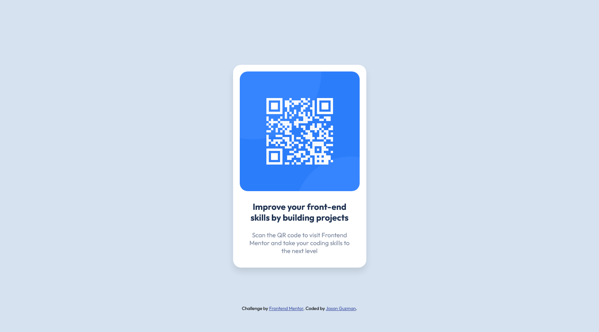

# Frontend Mentor - QR code component solution

This is a solution to the [QR code component challenge on Frontend Mentor](https://www.frontendmentor.io/challenges/qr-code-component-iux_sIO_H). Frontend Mentor challenges help you improve your coding skills by building realistic projects. 

## Table of contents

- [Overview](#overview)
  - [Screenshot](#screenshot)
  - [Links](#links)
- [My process](#my-process)
  - [Built with](#built-with)
  - [What I learned](#what-i-learned)
- [Author](#author)

## Overview

### Screenshot



### Links

- Solution URL: [My solution](https://github.com/jsngzm/qr-code-solution)
- Live Site URL: [My website](https://qr-solution-jsngzm.netlify.app)

## My process

### Built with

- HTML
- CSS
- Flexbox

### What I learned

In this project, I gained a better understanding of CSS Flexbox and how to use a couple different units of measurement such as rem(root em) and vh(viewport height). I used the rem unit to adjust the title text to 1.3x the root font size (15px) used in the body property. I used vh to set the min-height and min-width so my card would be centered while resizing the browser.

```css
/* Using Rem */
.title {
    font-size: 1.3rem;
    text-align: center;
    color: hsl(218, 44%, 22%);
    padding: 20px 10px;

/* Using vh */
body {
    font-family: "Outfit", sans-serif;
    background-color: hsl(212, 45%, 89%);
    font-size: 15px;
    display: flex;
    flex-direction: column;
    justify-content: center;
    align-items: center;
    min-height: 100vh;
    min-width: 25vh;
```
## Author

- Website - [Jason Guzman](https://github.com/jsngzm)
- Frontend Mentor - [@jsngzm](https://www.frontendmentor.io/profile/jsngzm)
